# Hangman
This hangman game replicates the traditional "pen and paper" game, but instead within a python terminal. This game aims to allow users to be able to play games of hangman, independently, against the computer. Players can choose a difficulty (easy, medium, hard) to randomly generate a word from the corresponding list. Users can input an individual letter to guess if the word contains the letter. The user starts the game with six lives; meaning that if six incorrect guesses are provided, they lose the game. The user can win the game by guessing all of the letters in the word. Throughout the game, the user constantly receives feedback, such as updates to the word, remaining lives, input requests etc, to make the game intuitive for the user.

The target audience for this project would include fans of the traditional hangman game that perhaps want to try a virtual version of the game, or people that have no playing partner so rely on playing individually against a computer. Users can play for fun, but also have the possibility of challenging themselves with the hard difficulty.

## Planning

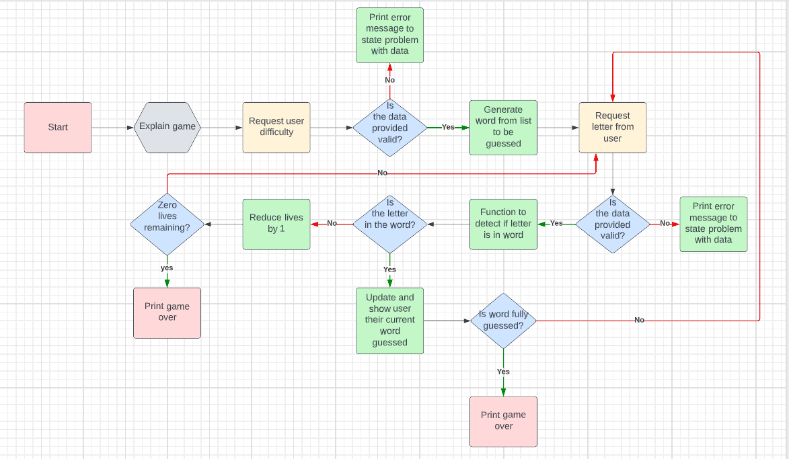

## Features
### request_difficulty() function

- Requests the user to select a difficulty by inputting a string input. Tries to set the diffculty variable but if the wrong
input is provided, a ValueError is raised and the user can try again. Once the user inputs the correct string, the function
returns the difficulty.
    - User is requested to input 'e' for easy, 'm' for medium, or 'h' for hard diffculty. The input is assigned to the difficulty variable and .lower method is used on the input to convert any uppercase inputs.
    - Input validation is used to try and set the value of the diffculty variable from 'e', 'm' or 'h' to 'easy', 'medium', or 'hard'. The difficulty is returned if there is no exception raised.
    - If the input was an integer, a TypeError is raised and the user receives feedback to explain the error. The request_difficulty function is called again so the user has another opportunity to select a diffculty.
    - If the input isn't equal to 'e', 'm' or 'h', a ValueError is raised and the user receives feedback to explain the error. The request_difficulty function is called again so the user has another opportunity to select a diffculty.

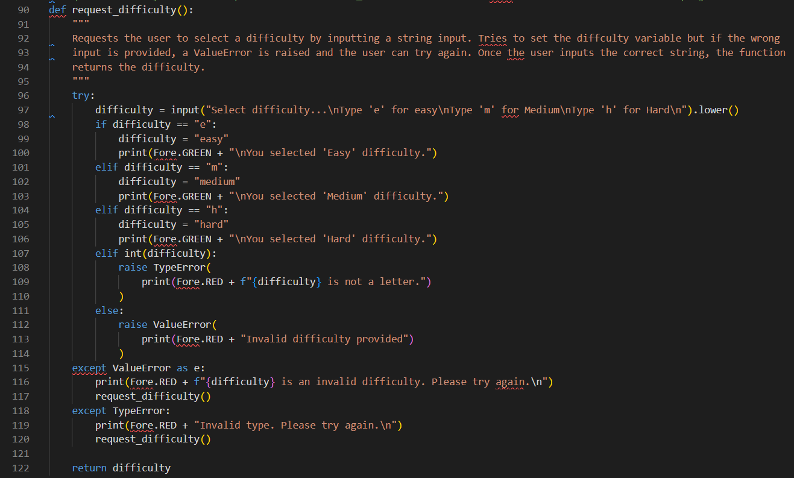

### set_list(difficulty) function

- Uses the difficulty variable value as an argument to select a list to choose a word from.
    - Three global variables are defined outside of the function (easy_words, medium_words, hard_words). Each contain a list of 15 strings (words).
    - The difficulty argument is stored in a 'level' variable. 
    - Conditionals are used to check value of 'level' and then assign either the 'easy_words', 'medium_words', 'hard_words' list to the variable 'selected_list'.
    - The selected_list variable is returned.

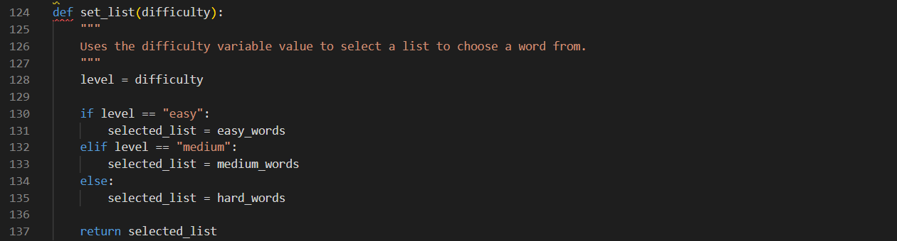

### generate_word(word_list) function

- Takes the selected list as a parameter and randomly selects one word from the list.
    - The selected_list variable is passed into the function.
    - The random.choice method is used to randomly select one word from the list and store it in the selected_word variable.
    - The selected_word variable is returned.

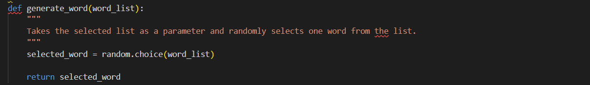

### show_hidden_word(selected_word) function

- Converts the randomly selected word into a string of equal length but with hidden letters.
    - The selected_word variable is passed into the function.
    - The len function is used to calculate the length of the selected_word. This is multiplied with the string "-" to create a string of dashes with equal length to the selected_word. This string is stored in the hidden_word variable.
    - The hidden_word variable is returned.
    - This hidden_word variable is important as it needs to be printed to the user so they can see the length of the word they need to guess the letters for.

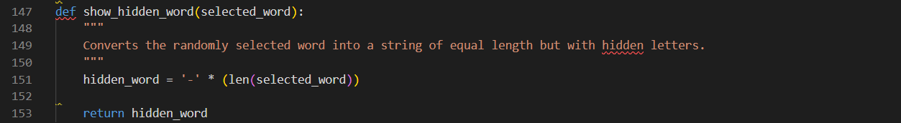

### request_letter() function

- Requests the user to input a letter as a guess and validates it.
    - User is requested to input a single letter as a guess. The input is assigned to the guess variable and .lower method is used on the input to convert any uppercase inputs.
    - Conditionals are used to raise a ValueError for empty inputs, non-letters, more than 1 letter and inputs already guessed.
    - Checking for inputs already guessed was possible by the else statement appending each guess to a global list storing all of the guesses. The exception could then be raised if the input is already in the the list.
    - Users receive feedback after each input and if the exception is raised, the function is called again so that they can input again.

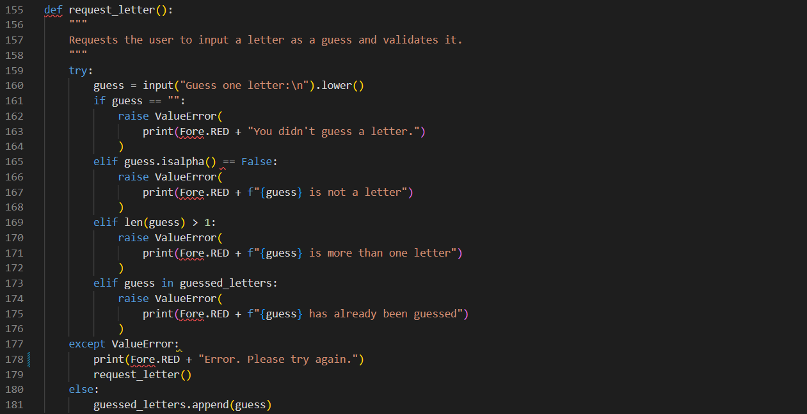 

### check_letter_in_word(letter, selected_word)

- Will check if the guessed letter is in the selected word. Will pass last item of the guessed_letters list as it is most recent.
    - The most recent letter guessed to by the user is passed into the function by accessing the last index of the guessed_letters list (e.g. guessed_letters[-1]). This value is stored in the recent_guess variable. The selected_word is also passed into the function.
    - Conditionals are used to check whether the recent_guess is in the selected_word and users receive feedback about their guess.
    - If the recent_guess is in the selected_word, the recent_guess is returned and stored in the correct guess variable when the function is called. If recent_guess isn;t in the word, the function returns None.

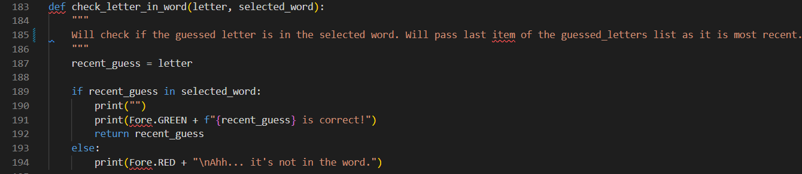

### update_hidden(correct_guess, selected_word, guess_state)

- If there is a correct guess, will search for the position of the letter in the word. Then changes the "-" value in the hidden word to the correct letter to update it.
    - Passes the correct_guess (either a letter or None), selected_word and guess_state (hidden word's current value e.g --e--).
    - Using conditionals, if the correct_guess is None, the hidden word will remain unchanged. The guess_state is stored in the hidden_word and returned.
    - Else, the correct_guess needs to be found in the word. The arguments are stored in variables. Within an infinte while loop, the .find() method is used to find the index of the correct_guess in the word and stored in the variable 'index'. The .replace() method is used to replace the letter with "-" (on the next loop iteration, the letter won't be found at that index again. Allows us to check for the same letter at another index.). The temp variable stores a list version of the hidden word. The letter value can then be assigned to temp at the correct index. The .join method joins the list to an empty string and stores in the 'hidden' variable. The loop repeats as it is possible for the letter to apear multiple times in the word. Once the letter is no longer found, the loop breaks and the hidden is returned.

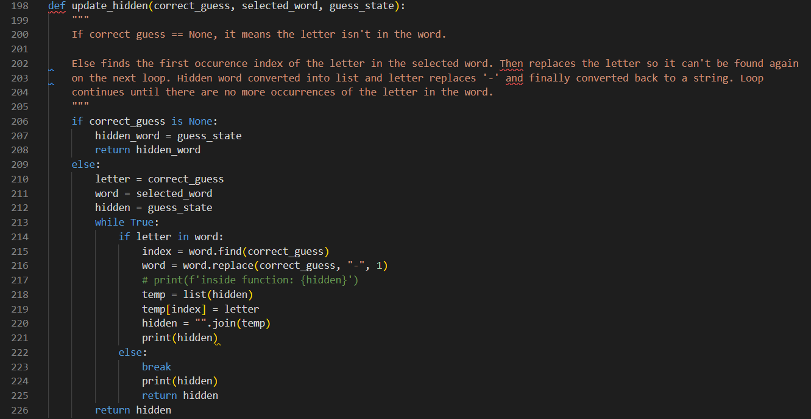

### check_finished(guess_state)

- Checks if there are any more missing letter left in the hidden word. If there are no missing letters, congratulates the user 
    and returns True.
    - Passes the hidden_word as an argument and stores in hidden variable.
    - If the "-" string is not in the hidden variable, the user receives feedback to congratulate them and inform that the word has been guessed.
    - Function returns True.

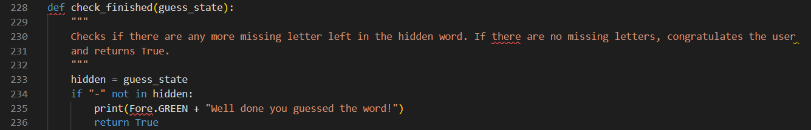

### play_again()

- Once a game is over, asks the user if they want to restart the game or finish playing.
    - Asks the user if they want to play again and to type 'y' for 'yes' and 'n' for 'no'. Input stored in response variable.
    - Input validation tries conditionals.
    - If the response.lower() equals 'y', the user receives feedback and the start_game function is called to restart the game. 
    - If the response.lower() equals 'n', the user receives feedback and the game ends.
    - Empty inputs raise a ValueError. The user receives feedback to explain the error and the play_again function is called again to ask the user for another input. 
    - Integer inputs raise a TypeError. The user receives feedback to explain the error and the play_again function is called again to ask the user for another input.

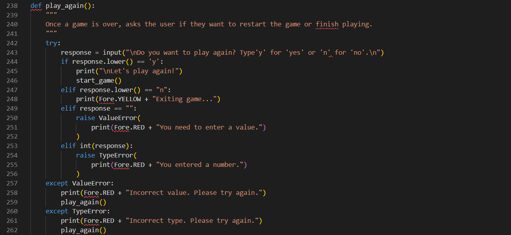

### start_game()

- Calls the individual functions in the correct sequence to initiate and control the flow of the game.
    - Initiates variables guessed_letters and remainining_lives by assigning values directly.
    - Initiates variables difficulty, selected_list, selected_word, hidden_word by calling their appropriate functions so they are assigned the returned values.
    - An infinite while loop is used for the remaining functions. 
    - Conditionals are used to check if the correct_guess is None. If True, remaining lives decrease by 1 and the user receives feedback. A deeper condition checks for if the remaining_lives are equal to zero. If true, the user receives feedback and the loop breaks.
    - If the correct_guess isn't None, a condition checks if the check_finished function is equal to True. If True, the user receives feedback and the loop exits.
    - Outside the loop, the play_again function is called so that user has the option to restart the game.

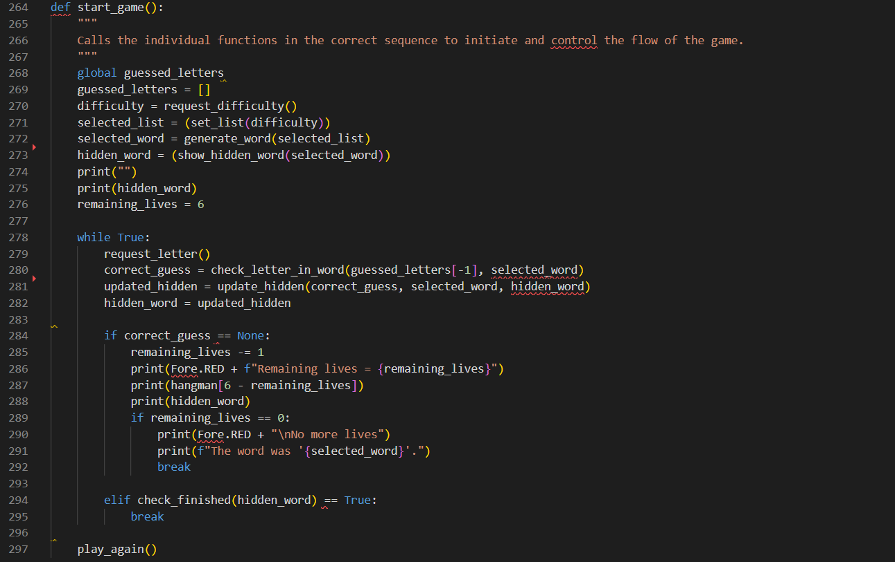

## Future Features

- API / Google Sheet
    - Instead of storing the words for the game in Python lists, the data could be stored in a Google Sheet and accessed via an API.
- Changing the number of lives
    - The current difficulty levels only differ by how hard it is to guess each word. Instead, each difficulty level could have differing numbers of lives.

## Testing

### High Level Test Cases

Local and Heroku terminals have been used for testing:

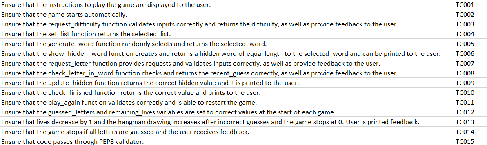

User Stories:
- As a user, I want to understand the purpose of the game - TC001, TC002
- As a user, I want to have instructions so I can understand how to play the game - TC001
- As a user, I want to be able to choose different difficulties - TC003, TC004
- As a user, I want to know if my guess was successful - TC007, TC008
- As a user, I want to know how many lives I have left and see the hangman drawing update - TC012, TC013
- As a user, I want to know how many letters are in the word and how many to guess are remaining - TC006, TC009
- As a user, I want to know the result of the game - TC010, TC013, TC014
- As a user, I want to be able to play multiple games - TC011

### High Level Test Case Results

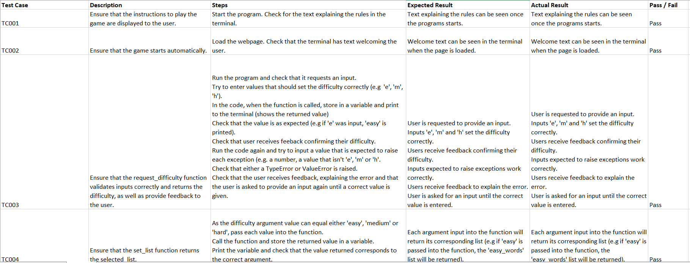

Full results can be found here: https://github.com/JamesMartin1998/Python-Project/blob/main/test%20cases.xlsx

### PEP8
- Code passes through PEP8 linter with no problems.

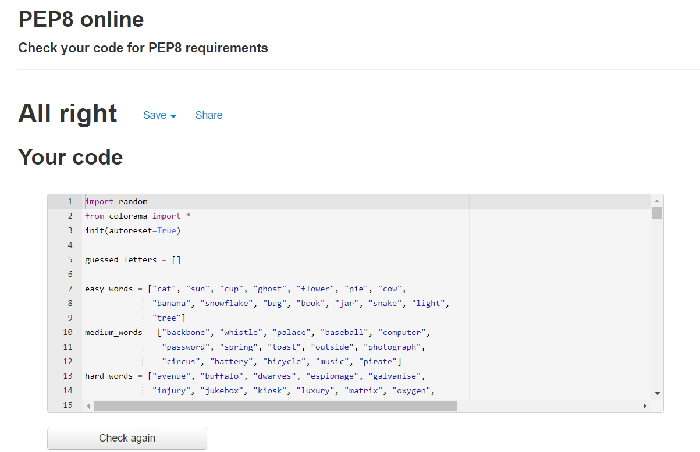

## Bugs

### Solved Bugs

- An early error I encountered was when the hidden word would only update with most recent guess. This was fixed by storing the reurned value in a variable and passing the variable multiple times in a loop.

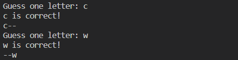

- For words with multiple occurrences of a letter, only the first occurrences was found. This was fixed by using a while loop. When the letter was found, it was removed and the word would be searched again until the letter is no longer found.
- A difficult error to solve occurred when correct guess followed an incorrect guess. I found that the update_hidden function, if the correct_guess was equal to None, the hidden_word wasn't being returned from the function. This caused the hidden_word value to equal None and cause an error when it was passed into the update_hidden function later. Returning the hidden_word fixed the bug. 

### Remaining Bugs

- No bugs remaining.

## Deployment

### Heroku

Throughout the project, version control was used by committing and pushing the code to GitHub.
The GitHub repository can be found here: https://github.com/JamesMartin1998/Python-Project

- This project was deployed to Heroku by:
    - Within Gitpod, adding the dependencies to the requirements file by typing 'pip3 freeze > requirements.txt' in the terminal.
    - Committing and pushing the code to GitHub.
    - On the Heroku website, clicking 'Create New App'.
    - Setting the name and region and pressing 'Create App'.
    - Clicking the 'Settings' tab.
    - Setting a config var: key = PORT, value = 8000. Press 'add'.
    - Clicking 'Add Buildpack', 'Python', 'Save Changes'.
    - Click the 'Deploy' tab.
    - Click 'Connect to GitHub', search for repository, click 'Connect'.
    - Enable Manual Deploy. Check for successful message.
    - Enable Automatic Deploys.

The live site can be found here: https://project3-hangman.herokuapp.com/

### Run Locally

- This project can be run locally by:
    - Opening the project repository.
    - Opening the dropdown on the 'code' button.
    - Downloading the zip file.
    - Extracting the files from the zip file into a new folder on your computer.
    - Opening the folder in an IDE of your choice.
    - Installing Colorama by typing "pip install colorama" in the terminal.
    - Typing "python run.py" in the terminal.

## Credits

- Colour was produced in the terminal by installing and importing the Colorama library.
- Request diffculty function adapts from the validate_data function used in Code Institute's Love Sandwiches project
-  update_hidden function adapts on code from following link: https://tutorial.eyehunts.com/python/python-replace-character-in-a-string-by-index-example-code/#:~:text=Replace%20Character%20at%20a%20given,list%20items%20to%20the%20string
- Thanks to Oisin, a tutor a Code Institute for helping me to solve the error where a correct guess after an incorrect guess caused the program to crash.
- Thanks to my mentor, Ronan, for his support during the project.
- Code Institute provided the template including the terminal for deployment.

